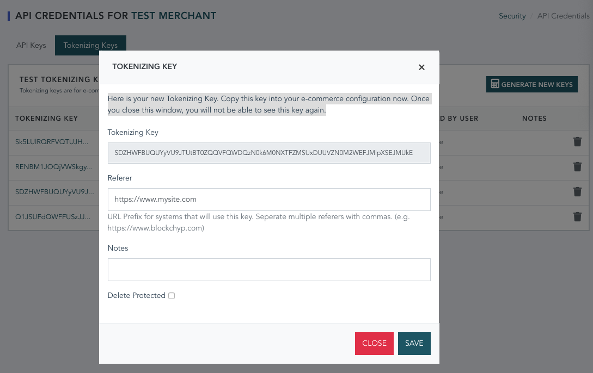

# The BlockChyp Web Tokenizer

This is a simple Javascript library intended to connect public e-commerce or
payment pages to BlockChyp in a secure way that minimizes PCI scope.

This library sends card data directly to BlockChyp from the browser and returns
a token that can then be used to perform subsequent server side authorizations.  It prevents merchants and e-commerce providers from handling and being responsible for PCI scoped cardholder data.

Developers can take advantage of this functionality in two different ways:

**Cross Origin IFrame:** The most secure and popular option is to allow BlockChyp to render the
card data input controls.  This will put the sensitive card data entry
fields into a cross-origin iframe hosted by BlockChyp, which means that
card data input controls are not accessible from the parent payment page.
According to the PCI Council, developers using this method are eligible for
SAQ A (self assessment) and do not require a fully validated ROC (record of compliance).

**Direct Tokenization:** The downside of the iframe based approach is that merchants and e-commerce
providers have limited control of the user experience.  While BlockChyp's iframe based tokenization does allow for custom CSS and a fair degree of
customization, some developers may wish for more fine grained control of
how the input control looks.

Developers can use their own forms and input controls and submit the
card data to BlockChyp's tokenizer directly, but it comes with additional
security and PCI compliance burdens.  Developers using their
own forms and input controls must carefully guard against malicious JavaScript
code running on their pages, since such Javascript will have access to the
DOM and all input elements.  Developers using direct Javascript tokenization
without iframes are also required to retain a QSA and complete a ROC if their
transaction volume is above the usual self assessment levels.

More detail on PCI compliance rules for each scenario can be found in [Best Practices for E-Commerce E-Commerce](https://www.pcisecuritystandards.org/pdfs/best_practices_securing_ecommerce.pdf), a
supplement to the core PCI security standard provided by the PCI Council.

## Installing The Tokenizer

The tokenizer can be obtained directly from BlockChyp or via NPM.

### NPM

If you're using NPM, the following code will add the BlockChyp Tokenizer as
a project dependency.

```
npm install blockchyp-tokenizer --save
```

### Manual Installation

You can also drop the tokenizer directly into web pages by pasting the following script tag:

```
<script src="https://api.blockchyp.com/static/js/blockchyp-tokenizer-all.min.js"></script>
```

## Using The Tokenizer

Regardless of your integration and installation methods, you'll need a tokenizing key
before you can tokenize payment cards.  In the BlockChyp dashboard, under API Credentials, click the Tokenizing Keys tab and generate a new key.  You'll see
a popup form like this:



Add your web site as a referer, copy the Tokenizing Key to your configuration, and save the key.  You won't be able to see the full tokenizing key ever again.  In
production, we recommend delete protection.

### IFrame Based Tokenization (Recommended)

If you've wisely chosen to use the outsourced iframe approach, you'll need to
create a form with a placeholder DIV for the payment input.  You should also
add a cardholder name input to your form that you manage yourself.  Consider
the following example:

```
<form onsubmit="submitPaymentForm(event)">
  <div class="form-group">
    <label for="secure-input">Card Number</label>
    <div id="secure-input" class="form-control"></div>
    <div id="secure-input-error" class="alert alert-danger" style="display: none;"></div>
  </div>
  <div class="form-group">
    <label for="cardholder">Cardholder Name</label>
    <input class="form-control" id="cardholder"/>
  </div>
</form>
```

Create a DIV wherever you'd like the input control.  Assign the DIV a unique ID
of your choosing and optionally provide a second DIV whose id should be the same
as that of the payment input appended with '-error'.

#### IFrame Rendering and Tokenization (Conventional Web Page)

If your application uses a conventional web page, call `render()` when your page
loads to initalize the input control and `tokenize()` when you're ready to tokenize
the card.  The example below shows how this might work with jQuery.

jQuery Example:
```
$( document ).ready(function() {
    // options not required
    var options = {
      // if true, will add postal code to the secure input
      postalCode: false,

      // optional name of your front end framework (i.e. 'bootstrap4', 'boostrap3', 'materialize', 'foundation')
      // The input will be rendered for best compatibility with your framework
      framework: 'bootstrap4'
    };
    // second argument is true if you're using test creditials
    tokenizer.render('<TOKENIZING_KEY>', true, 'secure-input', options);
});

function submitPaymentForm(event) {

  event.preventDefault();

  var req = {
    test: true,
    transactionRef: 'YOUR TRANSACTION OR TENDER ID',
    postalCode: $('#postalCode').val(), //if you have a seperate postal code input
    cardholderName: $('#cardholder').val()
  }

  tokenizer.tokenize('<TOKENIZING_KEY>', req)
    .then(function (response) {
      console.log(JSON.stringify(response.data));
      console.log("Token: " + response.data.token);
      //add your real form submission code here
    })
    .catch(function (error) {
      console.log(error);
    })

}
```

Sample JSON Response:
```
{
  "success": true,
  "error": "Approved",
  "responseDescription": "Approved",
  "transactionId": "M3X3RZRIFAI6VO4ENSLM7WZLHE",
  "transactionRef": "YOUR TRANSACTION OR TENDER ID",
  "token": "USAXQBVT3IKRZQ5XQUASZEXISE",
  "entryMethod": "ECOM",
  "paymentType": "VISA",
  "maskedPan": "************1111",
  "expMonth": "12",
  "expYear": "25"
}
```

`render()` will draw the input form with your preferences and add any
payment errors to the error DIV, if defined.

By default the payment input is optimized for Bootstrap 4 'form-control' inputs.
If you use a different front end framework, you can declare it as an options parameter.  As of this writing, the tokenizer supports 'bootstrap4', 'bootstrap3',
'materialize', and 'foundation'.  You can also fully customize the iframe's CSS. (More on that later.)

The input can optionally prompt for postal codes by adding the `postalCode` flag
to options.

`tokenize()` will validate and submit the payment information to the BlockChyp
gateway for tokenization.  It returns a promise with a token and all the usual
meta data you might need.

#### IFrame Rendering and Tokenization (ES6 / Single Page Applications)

If you're using a single page application framework like React or Vue.js,
you'll want to go about this a bit differently.

The example below shows how this would work with an ES6 framework like Vue.js.

The form below shows a minimal input form template for Vue.js.

```
<form @submit="submitPaymentForm(event)">
  <div class="form-group">
    <label for="secure-input">Card Number</label>
    <div id="secure-input" class="form-control"></div>
    <div id="secure-input-error" class="alert alert-danger" style="display: none;"></div>
  </div>
  <div class="form-group">
    <label for="cardholder">Cardholder Name</label>
    <input class="form-control" v-model="cardholder"/>
  </div>
</form>
```

The code below shows how rendering and tokenization would work with Vue.js.
```
<script>
import BlockChypTokenizer from '@blockchyp/blockchyp-tokenizer/dist/tokenizer.js'

export default {
  name: 'iframe-tokenizer',
  data: () => ({
    tokenizingKey: '<TOKENIZING_KEY>',
    cardholder: null,
    secureInputRendered: false
  }),
  // can't render the input until Vue draws the UI, but only draw once
  updated: function () {
    let self = this
    this.$nextTick(function () {
      if (!self.secureInputRendered) {
        self.renderSecureInput()
      }
    })
  },
  methods: {
    renderSecureInput: function () {
      this.secureInputRendered = true
      let options = {
        postalCode: false,
        framework: 'bootstrap4'
      }
      BlockChypTokenizer.render(this.tokenizingKey, true, 'secure-input', options)
    },
    executeTokenize: function() {

      let req = {
        test: this.testModel,
        cardholderName: this.cardholder
      }

      BlockChypTokenizer.tokenize(this.tokenizingKey, req)
        .then(function (response) {
          console.log(JSON.stringify(response.data));
          console.log("Token: " + response.data.token);
          //add your real form submission code here
        })
        .catch(function (error) {
          console.log(error);
        })
    }
  }
}
</script>
```

#### Custom CSS

The options framework property is intended to reduce the number of situations
where using custom CSS for the payment input might be necessary, but this
isn't a complete solution.  Some of you will need more fine grained control over
your input rendering.

The options option also has a style property for use in situations where custom
CSS in necessary.  Custom CSS is passed into the options object as a Javascript
map as show in the following example.  This example includes most of the default
CSS for Bootstrap 4 which can be tweaked for custom scenarios.

```
  var options = {
    framework: 'none',
    style: {
      '#secure-input': {
        'font-size': '14pt',
        'min-width': '345px'
      },
      '#secure-input input': {
        'border': '0',
        'font-size': '14pt'
      },
      '#secure-input input:focus': {
        'outline-width': '0'
      },
      '#secure-input .panInput': {
        'margin-left': '3px',
        'margin-right': '3px',
        'min-width': '140px'
      },
      '#secure-input .dateInput': {
        'width': '35px'
      },
      '#secure-input .cvvInput': {
        'width': '40px',
        'margin-left': '3px'
      },
      '#secure-input .postalCodeInput': {
        'width': '100px',
        'margin-left': '3px'
      },
      '.placeholderText': {
        'font-weight': 'bold',
        'color': '#777777'
      },
      '.cardIcon': {
        'color': '#777777',
        'font-size': '18pt'
      },
      '#cardImage': {
        'max-height': '24px'
      }
    }
  }

  tokenizer.render('<TOKENIZING_KEY>', true, 'secure-input', options);

```
Custom CSS can extend and override the existing CSS for a given front end
framework or style the input completely from scratch.  Setting framework to
'none' will remove all framework CSS from the input element.

Note that any CSS that references external files or images will not be supported.

### Direct Tokenization (Not Recommended, Increases PCI Scope)

This method bypasses the cross-origin iframe and allows you to pass
card data directly into the tokenizer.

**Note:** This method does not protect payment forms from malicious JavaScript
and may require a fully validated Record of Compliance for PCI Certification.

To use this method of tokenization, create a form with all the usual payment
fields as shown in the following jQuery based example:

```
<form onsubmit="submitPaymentForm(event)">
  <div class="form-group">
    <label for="pan">Card Number</label>
    <input class="form-control form-control-sm" id="pan"/>
    <div class="input-group">
      <input class="form-control form-control-sm" id="expMonth" placeholder="MM"/>
      /
      <input class="form-control form-control-sm" id="expYear" placeholder="YY"/>
      <input class="form-control form-control-sm" id="cvv" placeholder="CVV"/>
      <input class="form-control form-control-sm" id="postalCode" placeholder="ZIP CODE"/>
    </div>
  </div>
  <div class="form-group">
    <label for="handsoff.cardholder">Cardholder Name</label>
    <input class="form-control form-control-sm" id="cardholder"/>
  </div>
  <button type="submit" class="btn btn-primary">Submit</button>
</form>
```

The form submission handler is largely the same as for an iframe based form, with the exception of adding card data manually to the request.

jQuery Example:
```
function submitPaymentForm(event) {

  event.preventDefault();

  var req = {
    test: true,
    transactionRef: 'YOUR TRANSACTION OR TENDER ID',
    postalCode: $('#postalCode').val(), //if you have a seperate postal code input
    cardholderName: $('#cardholder').val(),
    pan: $('#pan').val(),
    expMonth: $('#expMonth).val(),
    expYear: $('#expYear).val(),
    cvv: $('#cvv').val()
  }

  tokenizer.tokenize('<TOKENIZING_KEY>', req)
    .then(function (response) {
      console.log(JSON.stringify(response.data));
      console.log("Token: " + response.data.token);
      //add your real form submission code here
    })
    .catch(function (error) {
      console.log(error);
    })

}
```

Sample JSON Response:
```
{
  "success": true,
  "error": "Approved",
  "responseDescription": "Approved",
  "transactionId": "M3X3RZRIFAI6VO4ENSLM7WZLHE",
  "transactionRef": "YOUR TRANSACTION OR TENDER ID",
  "token": "USAXQBVT3IKRZQ5XQUASZEXISE",
  "entryMethod": "ECOM",
  "paymentType": "VISA",
  "maskedPan": "************1111",
  "expMonth": "12",
  "expYear": "25"
}
```
